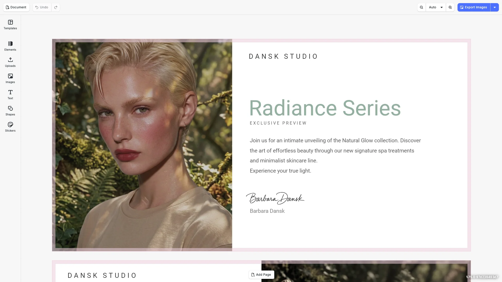

# Perfectly Clear Editor Starter Kit

One-click image enhancement powered by Perfectly Clear (eyeQ). Built with [CE.SDK](https://img.ly/creative-sdk) by [IMG.LY](https://img.ly), runs entirely in the browser via WebAssembly — no server round-trip, no model uploads.

<p>
  <a href="https://img.ly/docs/cesdk/js/plugins/perfectly-clear-e0fa1c/">Documentation</a>
</p>



## Features

- **One-click Image Enhancement** — Perfectly Clear (eyeQ) image correction:
  - **Canvas Menu**: Select an image, click the three-dot menu, and choose "Enhance"
  - Scene detection, skin-tone correction, AI color, noise reduction
  - Runs fully in-browser via WebAssembly
- **Text Editing** — Typography with fonts, styles, and effects
- **Image Placement** — Add, crop, and arrange images
- **Shapes & Graphics** — Vector shapes and design elements
- **Export** — PNG, PDF with quality controls

## Getting Started

### Clone the Repository

```bash
git clone https://github.com/imgly/starterkit-perfectlyclear-editor-ts-web.git
cd starterkit-perfectlyclear-editor-ts-web
```

### Install Dependencies

```bash
npm install
```

### Configure API Keys

The plugin needs both a CE.SDK license key and a Perfectly Clear (eyeQ) API key authorized for your origin.

Copy `.env.example` to `.env` and fill in both values:

```bash
cp .env.example .env
# then edit .env
```

Without `VITE_PFC_API_KEY` the editor still loads, but the Enhance button stays disabled and a warning is logged to the console.

### Download Assets

CE.SDK requires engine assets (fonts, icons, UI elements) served from your `public/` directory.

```bash
curl -O https://cdn.img.ly/packages/imgly/cesdk-js/$UBQ_VERSION$/imgly-assets.zip
unzip imgly-assets.zip -d public/
rm imgly-assets.zip
```

### Run the Development Server

```bash
npm run dev
```

Open `http://localhost:5173` in your browser.

## Usage

### Via Canvas Menu

1. Select an image on the canvas
2. Click the three-dot menu (canvas menu)
3. Select "Enhance" from the menu
4. The image is enhanced in-place; undo/redo work as expected

## Plugin Wiring

`@imgly/plugin-perfectlyclear-web` is a little different from most CE.SDK plugins: it registers a canvas-menu component but does **not** insert it into the canvas menu order on its own. That keeps it from colliding with the AI quick-action popover, which surfaces the same Enhance button when an AI image-generation plugin is installed.

So the kit's install is two calls instead of one:

```typescript
import PerfectlyClearPlugin, { PLUGIN_ID } from '@imgly/plugin-perfectlyclear-web';

// 1. Register the plugin (wires fill-processing metadata, registers the
//    canvas-menu component).
await cesdk.addPlugin(PerfectlyClearPlugin({ apiKey }));

// 2. Insert the canvas-menu component into the order.
cesdk.ui.setCanvasMenuOrder([
  `${PLUGIN_ID}.canvasMenu`,
  ...cesdk.ui.getCanvasMenuOrder()
]);
```

See [`src/imgly/plugins/perfectly-clear.ts`](./src/imgly/plugins/perfectly-clear.ts) for the full setup function.

## Architecture

```
src/
├── imgly/
│   ├── config/
│   │   ├── actions.ts                # Export/import actions
│   │   ├── features.ts               # Feature toggles
│   │   ├── i18n.ts                   # Translations
│   │   ├── plugin.ts                 # Main configuration plugin
│   │   ├── settings.ts               # Engine settings
│   │   └── ui/
│   │       ├── canvas.ts                 # Canvas configuration
│   │       ├── components.ts             # Custom component registration
│   │       ├── dock.ts                   # Dock layout configuration
│   │       ├── index.ts                  # Combines UI customization exports
│   │       ├── inspectorBar.ts           # Inspector bar layout
│   │       ├── navigationBar.ts          # Navigation bar layout
│   │       └── panel.ts                  # Panel configuration
│   ├── index.ts                  # Editor initialization function
│   └── plugins/
│       └── perfectly-clear.ts
└── index.ts
```

**Note:** The kit boots on a bundled demo template (`public/assets/enhance-image.archive`) — an archive containing the scene plus its fonts and images. Swap it in `src/index.ts` to use your own.

## Prerequisites

- **Node.js v22+** with npm — [Download](https://nodejs.org/)
- **Supported browsers** — Chrome 114+, Edge 114+, Firefox 115+, Safari 15.6+
- **Perfectly Clear (eyeQ) API key** authorized for your origin (contact Perfectly Clear / IMG.LY support)

## Troubleshooting

| Issue | Solution |
|-------|----------|
| Editor doesn't load | Verify assets are accessible at `baseURL` |
| Assets don't appear | Check `public/assets/` directory exists |
| Watermark appears | Add your license key |
| Enhance option missing | Ensure `@imgly/plugin-perfectlyclear-web` is installed and `VITE_PFC_API_KEY` is set |
| Enhance click fails silently | The Perfectly Clear API key may not be authorized for the current origin — check the browser console for the certificate error |

## Documentation

For complete integration guides and API reference, visit the [Perfectly Clear Plugin Documentation](https://img.ly/docs/cesdk/js/plugins/perfectly-clear-e0fa1c/).

## License

This project is licensed under the MIT License — see the [LICENSE](LICENSE) file for details.

---

<p align="center">Built with <a href="https://img.ly/creative-sdk?utm_source=github&utm_medium=project&utm_campaign=starterkit-perfectlyclear-editor">CE.SDK</a> by <a href="https://img.ly?utm_source=github&utm_medium=project&utm_campaign=starterkit-perfectlyclear-editor">IMG.LY</a></p>
